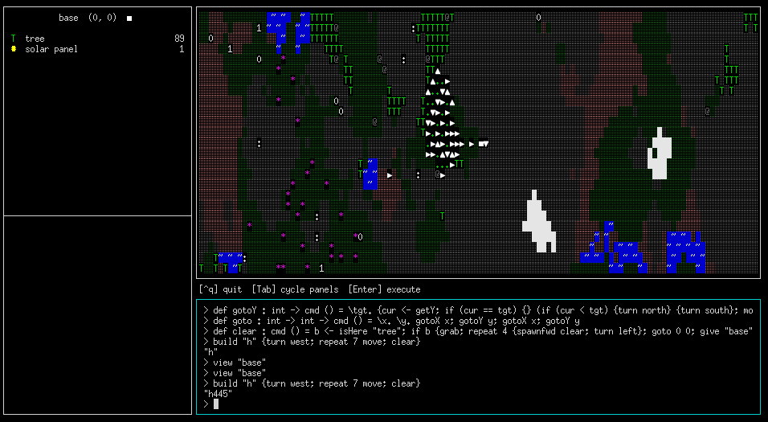

Swarm
=====

Swarm is a 2D programming and resource gathering game. Program your
robots to explore the world and collect resources, which in turn
allows you to build upgraded robots that can run more interesting and
complex programs.

The implementation is still in a very early stage, but planned
features include:

* 2D, infinite, procedurally generated worlds
* Simple yet powerful programming language based on the polymorphic
  lambda calculus + recursion, with a command monad for describing
  first-class imperative actions
* In-game tutorial
* Multiple game modes:
    - In Classic mode, you start with the ability to produce only very
      basic, limited robots; collecting resources allows you to
      bootstrap your way into programming more sophisticated robots
      that can explore more of the world, collect more resources, etc.
    - Hardcore mode is like Classic mode, but you start with only a
      limited number of robots.  If they get stuck or you run out of
      resources, it's game over!
    - Sandbox mode places no restrictions: program robots to your
      heart's content using whatever language features you want,
      without worrying about collecting resources.
    - In Challenge mode, you attempt to program robots in order to
      solve pre-designed puzzles or challenges.
    - Future versions might also have multiplayer modes, with co-op or
      PvP play over a network...?

Installing
==========

Warning: Swarm is still in a very early stage; it's still missing many
of the planned features and has no help or tutorial system at all.
But you can program cute little robots, and hey, that's all that
really matters, right?

The recommended way to install Swarm at the moment is as follows:

1. Clone the Swarm repository, e.g.

       git clone https://github.com/byorgey/swarm.git

1. Get the [`ghcup` tool](https://www.haskell.org/ghcup/).
1. Use `ghcup` to install the `stack` tool:

       ghcup install stack

1. Now use the `stack` tool to build and run Swarm:

       cd /path/to/the/swarm/repo
       stack run

1. Go get a snack while `stack build` downloads a Haskell compiler and
   builds all of Swarm's dependencies.
1. Have fun!

Contributing
============

If you want to help out, you're most welcome!  There are *lots* of
ways to contribute, regardless of your Haskell background.  For
example, even someone with no Haskell experience whatsoever could
still help with *e.g.* game design, playtesting, and level design for
challenge mode.

Eventually, this space will probably describe a lot more specific
kinds of tasks, there will be an issue tracker with things labeled as
good first ways to contribute, etc.  For now, though, if you're
interested to help out, just get in touch (see my email in my GitHub
profile, or contact me via IRC---`byorgey` on Libera.Chat).

